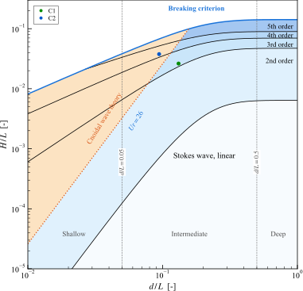

# Wave Theory Selector

波浪理论选择工具，用于海洋/海岸工程中选择合适的波浪理论。

## 功能

- 输入波高 H、周期 T、水深 d，自动推荐适用的波浪理论
- 支持规则波和不规则波
- 交互式 GUI 界面，支持单点和批量计算
- 绘制理论选择图（d/L vs H/L）
- 导出 PNG/SVG/CSV

## 支持的波浪理论

- 线性波 (Airy)
- Stokes 2-5 阶
- 椭圆余弦波 (Cnoidal)
- 给出破碎判据

## 使用方法

在 MATLAB 中运行：

```matlab
waveTheoryGUI
```

## 文件说明

| 文件 | 说明 |
|------|------|
| `waveTheoryGUI.m` | GUI 主程序 |
| `computeWaveCondition.m` | 波浪参数计算 |
| `plotBaseChart.m` | 理论选择图绘制 |
| `plotWavePoint.m` | 绘制数据点 |
| `stokesOrderCurves.m` | Stokes 阶数分界曲线 |

## 参考文献

Zhao, Wang & Liu (2024)

## 示例


